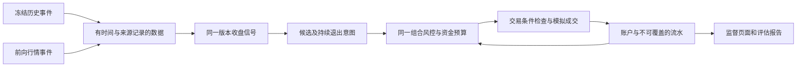

# 趋势组合系统总迭代设计

版本：v1.0 · 更新：2026-10-08 · 状态：后续开发主线。

本文件承接已确认的“自动管理组合、中期趋势、回撤优先”，管理从独立模拟原型到具备完整验证证据的组合系统这一轮大迭代。它既是后续开发入口，也是每次交付核对范围与验收条件的依据。当前只完成基础实现和离线工程验证，后续项均按下文状态推进，不因本文件定稿而视为已经实现。

## 1. 文档职责与优先关系

| 文档 | 回答的问题 | 维护方式 |
|---|---|---|
| 本总迭代设计 | 后续先做什么、依赖什么、做到什么程度算完成 | 每次交付更新阶段状态、验收证据及下一项 |
| [产品与策略基线](产品与策略基线.md) | 产品目标、策略规则、风险阈值是什么 | 作为规则唯一说明来源；变更先记录理由与版本 |
| [实施记录](实施记录.md) | 已交付什么、改过哪些文件、实际验证了什么 | 按交付追加事实、测试结果与限制 |
| [策略审查记录](策略审查记录.md) | 发现过哪些缺陷、如何复现与修复 | 保留原始证据及回归对应关系 |
| [定位决策](../adr/0001-portfolio-system-positioning.md) / [业务词汇](../../CONTEXT.md) | 为什么选择这条方向、术语指什么 | 重大取舍写决策记录，术语保持一致 |
| [版本路线图](../版本路线图.md)及旧版本设计 | 旧系统怎样演进、哪些能力可复用 | 保留历史；与本轮定位冲突的旧边界不再作为新组合要求 |

用户后续明确决定优先于本文。本文不另建一套策略参数；数值以《产品与策略基线》为准。后续子迭代引用本文编号和对应基线条款，避免分散复制规则。

## 2. 本轮要解决的产品问题

现有项目已经有分析、评分、信号统计、模拟账户和研究能力，但它们曾各自承担交易解释，导致“信号看起来好”与“组合实际可执行且风险可控”混在一起。新主线以完整账户为中心，串起数据、候选、订单、成交、持仓、风险和评估。

用户日常应能直接回答：

1. 账户现在有多少钱、持有什么、承担多大风险？
2. 系统准备做什么，为什么做，哪些计划没有成交？
3. 暂停、数据失效、公司行动或风险清仓是否需要处理？
4. 当前规则是否按约定运行，历史和前向证据支持怎样的结论？

不把逐笔选股、参数调节、故障排查重新交给不熟悉技术的用户。开发者负责确定有依据的默认实现，产品界面说明实际状态、影响和必要操作。

### 本轮边界

- 单用户、本地部署、固定初始虚拟资金、沪深主板现金做多；主策略为 `trend_portfolio_v1`。
- 独立模拟账户与旧 `qushi_v5` 账户各自记账，不合并净值，不自动迁移持仓。
- 复用现有行情、指标、撮合、费用和存储；新增抽象必须解决明确的复用或一致性问题。
- 不接券商、不下真实订单、不融资、不自动调参、不做多策略资金分配。
- 不把增加更多指标或美化看板作为验证缺口的替代方案。
- 新依赖、付费数据、外部服务或实盘范围变化须有单独理由与授权，本文不预先批准这些事项。

## 3. 当前基线：已具备与仍缺失

| 能力 | 当前状态 | 代码或证据 |
|---|---|---|
| 旧策略证据链修复 | B01–B16 已修复；有对应回归 | 审查记录、`tests/test_*regressions.py` 等 |
| 收盘信号 | 已实现主板/流动性/市场/完整周线过滤、55 日突破与独立 20 日退出 | `analysis/trend_portfolio.py` |
| 组合风险 | 已实现仓位及计划风险预算、回撤分档、恢复和清仓意图 | `backtest/portfolio_risk.py` |
| 模拟服务 | 已实现开盘窗口、幂等执行、有效报价检查、独立持久化和启停 | `server/trend_service.py` |
| 监督页面 | 已有账户、持仓、计划、未成交原因、事件与净值 | `/trend.html`、`/api/trend` |
| 运行版本 | 已保存源码摘要及费率；不一致停止执行 | `state.rules`；尚无完整升级处置流程 |
| 公司行动 | 仅发现价格基准异常并阻断估值/交易 | 尚无自动权益调整、核验和解除流程 |
| 工程验证 | 83 个测试文件的隔离检查及最后补丁回归通过 | 实施记录；服务 25 项、风险 15 项、信号 10 项 |
| 统一测试入口 | 仍有旧入口漏调函数，曾由临时隔离驱动补跑 | 需在 TP1 建立仓库内可复现入口 |
| 历史组合评估 | 未完成 | 旧单信号统计不能替代组合资金曲线 |
| 真实环境观察 | 未开始合格前向观察 | 未完成真实行情全天及浏览器交互验收 |

当前新账户默认暂停；代码交付不等于账户已运行，也不等于策略有效。最终报告须分别标明工程、数据、风险、效果和前向观察状态。

## 4. 总体结构与不可破坏的约束

图示为目标结构：当前在线模拟链已实现，完整历史事件入口尚待 TP3。历史与前向允许数据适配不同，策略、风险和记账语义必须相同。

| 约束 | 后续开发要求 |
|---|---|
| 时点可知性 | 明确信号截止、实际可知、可执行、成交时间；周中不使用未完成周线，历史不读未来状态 |
| 候选不等于订单 | 获准额度在执行时检查；多单竞争同一现金、行业和风险预算，不能重复占用 |
| 行情异常不等于卖出信号 | 禁止凭空生成退出；已经确认的退出持续保存，取得有效数据后再执行 |
| 市场过滤不阻断退出 | 指数异常可禁止新增风险；个股数据和价格基准可核验时，已有止损/清仓仍能执行 |
| 成交受现实约束 | T+1、停牌、涨跌停、整手、费用、滑点均受同一撮合规则约束；未成交继续占用持仓与风险 |
| 风控优先 | 紧急组合风控、硬止损、趋势退出优先于买入；同一持仓不重复扣减 |
| 净值不造假 | 缺可靠报价或权益基准时净值保留缺口；回撤无法判断时不得标为达标 |
| 运行不能洗掉损失 | 新运行不覆盖旧流水、高点和失败；不能把历史亏损拼接消除 |
| 升级不悄悄换策略 | 保留原运行规则；不能编辑指纹、清空持仓或重置高点来绕过校验 |
| 通过测试不代表有效 | 日 K 近似不能声称验证分钟级止损；合成事件不能证明收益 |

## 5. 阶段划分与依赖

`TP` 是本轮文档中的子迭代编号，不替换旧 I7–I13 编号，也不自动启动任何工作流。每个子项应形成可独立审阅、测试和回退的交付。

| 编号 | 子迭代 | 优先级 / 状态 | 依赖 | 完成后的能力 |
|---|---|---|---|---|
| TP0 | 定位、缺陷修复、独立模拟基线 | 已完成工程交付 | 已确认定位 | 有清晰、可测试的组合原型 |
| TP1 | 可复现工程基线与版本安全 | P0 / 待开始 | TP0 | 一条命令验证；升级前能识别受影响运行并保留恢复依据 |
| TP2A | 当前行情与权益数据契约 | P0 / 待开始 | TP1 | 可判定当日行情、交易时段及公司行动是否可用 |
| TP2B | 历史可知数据与冻结快照 | P0 / 待开始 | TP2A 的契约 | 历史评估拥有真实样本范围与明确缺口 |
| TP3 | 同规则历史组合回放 | P0 / 待开始 | TP1；数据按 TP2B 契约 | 多股票竞争资金、完整记账的组合回放 |
| TP4 | 冻结实验与效果报告 | P1 / 待开始 | TP2B、TP3 | 可复现地评估风险、收益与基准差异 |
| TP5 | 异常处置与运行监督 | P0 / 待开始 | TP1、TP2A | 用户看得懂异常，开发者有可审计的恢复流程 |
| TP6 | 至少 60 个交易日前向观察 | P1 / 未开始 | TP1、TP2A、TP5 验收 | 真实时间中的执行与账务证据 |
| TP7 | 版本结论与下一轮决策 | P1 / 待开始 | TP4、TP6 | 明确继续验证、修改或停止的依据 |

推进顺序默认从 TP1 开始。TP3 可先用合成快照开发，正式效果报告须等 TP2B 数据验收；TP5 可与历史链并行。TP6 达到自己的前置条件后可以和 TP4 并行积累，不必空等历史报告。早期试跑保留记录，但不能自动计入合格观察天数。

## 6. TP1：可复现工程基线与版本安全

### 工作内容

1. 建立仓库内统一离线验证入口，兼容 `unittest`、文件内置入口及零参数 `test_*` 函数。明确发现、实际执行、通过、失败、跳过和未支持的用例；缺运行器/依赖不能静默通过。
2. 测试在隔离目录运行，禁止访问真实业务账户；默认阻断外部网络，localhost HTTP 测试单独允许。产出带源码版本、环境和执行命令的机器可读结果。
3. 固化信号、风险、行情失效、开盘过期、重复执行、T+1、持续跌停、锁等待、暂停竞争、写入中断与重启账务核对的回归入口。
4. 核对当前源码/成本快照机制的适用范围，记录规则版本、实现版本、费率和数据模式版本。先提供升级前检查与原版本恢复说明，再考虑显式迁移；避免无关代码变更无解释地锁住持仓。
5. 备份与恢复必须同时核对账户状态、成交流水、净值、待执行意图和活动运行指针，不能只恢复一个文件。

### 交付与验收

- 仓库内有可重复执行的验证命令和报告格式；新测试自动纳入发现范围，漏执行会失败。
- 同一测试入口连续执行不依赖前一次缓存或业务目录，实际业务文件不被修改。
- 在临时账户复现“流水已写、状态未写”“状态损坏”“费用变化”“仍有持仓时升级”；系统停止不一致执行，保留原证据，有明确恢复去向。
- 恢复验证在隔离副本演练，不靠覆盖真实运行证明成功。

主要落点：测试入口、`tests/`、`server/trend_service.py`、`backtest/sim_account.py`。不借此重写整个服务框架。

## 7. TP2：数据契约与权益处理

### TP2A：当日数据可用性

统一数据最小契约：标的与品种、交易日期、事件时刻、来源、抓取时刻、当时可知时刻、完整/临时状态、原始或复权价格口径、报价有效期及校验结论。已有字段可复用，新增字段应服务具体判断。

需要解决：

- 当前服务以指数当日 bar、个股报价和时间规则推断交易状态；补齐交易日历、休市、跨日与开收盘边界的明确来源及不可用行为。
- 分别表达“指数不可用”“单股不可用”“组合无法估值”“公司行动待核验”，让数据故障影响正确的操作范围。
- 原始成交价、复权指标价格与 ATR/止损基准有明确转换关系；禁止仅因数值接近就判定权益正确。
- 公司行动覆盖分红、送转、拆合股等实际需要支持的事件，记录公告/可知时间、权益生效日、份额与现金变化、来源和事件标识。缺来源时继续阻断，不能猜值。
- 核验或更正应先产生可审阅的账务影响，再按事件标识恰好应用一次；在同一事件中核对股数、现金权益、成本、止损及未成交订单，保留可回放的调整流水、原数据、处理前后差异及操作者。支持范围外事件明确标未支持。
- 原始昨收断档和公司行动两类异常分别处理：中断几天后恢复行情不能永久失去核对路径，也不能直接覆盖旧参考价抹掉权益变化。

验收至少覆盖：盘中半成品、收盘响应仍到昨日、日期重复/未来数据、长假、停牌复牌、除息导致昨收调整、股份增加、相同事件重试、更正错误事件、来源冲突与恢复后的估值。只实现检测/阻断不能将本项标为“权益处理完成”。

### TP2B：历史股票池与冻结快照

- 保存当时上市/退市、ST、板块、停牌、行业及足够预热数据；行业不可知时按统一未知组处理，不能套用今天的分类改善回测。
- 预先确定评估日期、股票池构建方法、预热区间和缺失数据处理。不能因为后来退市、跌幅大或抓取失败而事后剔除不利样本。
- 快照清单至少含源文件摘要、来源/时点、股票池构建版本、交易日历、公司行动/复权版本、费用适用口径和缺口列表。相同标识的数据不可被静默替换。
- 全历史、局部可用、仅合成数据分开标记。来源不足时交付明确缺口与补数方案；不得宣称无幸存者偏差。

验收：同一快照可复现；篡改/时点越界会被拒绝或明确失效；含退市/ST/长期停牌的样本不会因当前列表缺失而消失。数据方案先复用现有能力，确需新来源时再做选择。

## 8. TP3：同规则历史组合回放

### 目标与接口边界

回放接收冻结的多股票事件、初始账户、策略/成本版本和截止时间，输出计划、拦截、成交、持仓、风险状态与权益序列。复用 `analysis/trend_portfolio.py`、`backtest/portfolio_risk.py` 和账户撮合原语；将确实依赖实时抓取、线程或磁盘的部分留在适配层。

不得把现有 `simulate_signal` 的单笔收益相加成组合净值，也不能为回放单独写一套更容易成交的风控逻辑。新增 CLI/API 的命名与参数在本子项实现时确定，未实现入口不要提前写成可运行命令。

### 事件顺序

1. 在当时可知的边界应用已核验权益事件，取得同一时刻的有效价格与交易状态。
2. 更新净值/回撤，形成或保留组合减仓、止损及已确认趋势退出意图。
3. 尝试可执行卖单；T+1、停牌或跌停时保留未成交状态。
4. 在允许窗口内按候选确定顺序处理买单，每次重新检查现金和组合约束；过期或报价不满足条件则记录取消。
5. 每笔成交后立即更新账户与风险；收盘保存正式估值和次日计划。重复事件不能重复成交。

日线回放缺少真实首分钟报价和盘中路径时，须预先选择并披露开盘价代理、触价次序及限制假设。真实分钟事件模式与日线近似模式分别标记，不能从 OHLC 推导一条“真实发生过”的盘中路径。

### 验收

- 同一组固定事件通过在线服务的注入入口和离线回放，决策、股数、费用、现金、持仓及队列一致。
- 每个历史前缀重跑与全量结果的相应前缀一致，不能因追加未来数据改写已产生的决策。
- 覆盖多股同时入选、额度竞争、未知行业上限、先卖后买、跳空穿止损、开盘涨停、连续跌停、T+1、停牌、回撤跨档与恢复天数。
- 期末未卖出仍在持仓中，已实现与浮动收益分列；缺可靠估值不伪造完整净值曲线。
- 日期、来源或规则版本变化使缓存失效；同一输入重复回放结果可比对且可解释。

## 9. TP4：冻结实验与效果报告

### 先冻结，再运行

在查看结果前记录实验标识、规则/实现版本、数据清单、股票池、完整评估区间、预热、成本、日线或分钟假设、时间切分、基准和缺失处理。按基线默认前 70% 开发、后 30% 独立评估；已经查看或参与调参的区间保留观察历史，不能重新标成样本外。

有针对性的参数修改也要生成新版本及修改原因，不进行无记录的多组尝试后只展示最好结果。各版本的失败、数据不足和不利区间都保留。

### 报告内容

| 类别 | 必须展示 |
|---|---|
| 数据与假设 | 真实覆盖区间、股票数量/状态覆盖、预热、价格与成本口径、缺口与偏差 |
| 收益 | 扣费净值、累计与年化收益、已实现/浮动盈亏；年化不足以解释短样本时突出区间事实 |
| 风险 | 最大回撤、恢复时长、警戒/清仓/失败时点、无法估值区间及剩余持仓 |
| 执行 | 成交成本、换手、仓位、计划/成交数量、取消及延迟原因、期末未平仓 |
| 对照 | 同期沪深 300，以及基线约定的月度再平衡 60% 指数 / 40% 现金参考组合 |
| 分段与结论 | 开发/独立评估、上涨/下跌/震荡覆盖，约束是否满足和证据不足在哪里 |

指数参考不是直接可成交资产；披露现金收益假设、费用及可交易替代物误差。比较使用同一日期与成本声明，不能把缺失基准收益当作零。

验收：小型样本可手算复核净值、费用、回撤和基准；报告与原始流水可追溯；数据不足不输出“通过”；15% 风险目标按预先冻结的各区间单独判断。收益及风险改善的评价方式在实验清单预先确定，不能看到结果后改通过标准。

## 10. TP5：异常处置与运行监督

界面先清楚表达“当前能做什么、哪些操作被阻断、下一步是什么”。运行启停、风险档位、数据健康和验证结论分开显示，避免一个“正常”掩盖其他维度异常。

### 必须具备的流程

- 新建运行、启用、暂停、检查、查看原运行与导出证据；默认仍不自动启用。
- 当前“暂停模拟”同时停止买卖巡检，不是只停买入。产品必须披露风险；未来若增加“只禁止新买、继续退出”，用独立行为与测试定义，不暗改暂停语义。
- 公司行动、数据断档、账务不一致、版本不符分别提供原因和处理记录。恢复后不补买过期开盘计划，不重复成交，不清除已确认的退出。
- 12%/15% 后允许继续处置未平持仓，不恢复本次运行买入；新实验引用旧运行及失败原因。
- 跨运行保留策略版本的验收失败记录；当前风险终态主要存于单个运行，后续不能因新建账户显示正常而把该版本重新标为已通过。
- 已有持仓的代码升级先检查版本、权益和未执行计划；在原版本下安全处置或经明确迁移程序处理。备份、核对和恢复演练是交付内容，编辑指纹不是恢复方案。
- 长时间扫描不能挤掉持仓检查与收盘风险落盘。展示上次成功巡检、最近行情时刻、最近收盘定档、当前阻断及失败原因；性能阈值以开盘窗口和巡检要求验收。

### 验收

在隔离环境做真实浏览器交互验收：无账户、空仓、持仓、数据缺失、T+1、跌停、警戒、终止、损坏及恢复状态均有清楚且正确的行为。断网、慢响应、重复点击、重启、写入中断和版本变化均有可复现记录；GET 保持只读，无后台隐式开户/启用。

## 11. TP6：至少 60 个交易日前向观察

这项依赖真实时间，不能在开发会话中完成。TP1、TP2A、TP5 验收后才开始正式计数。是否启用某个独立账户单独记录，文档或代码提交不触发运行。

### 观察计数

- 记录所有计划观察日，包括故障、中断和零成交日；不能删除坏日子美化可靠性。
- 一个合格交易日须有正确版本、可核验数据、收盘计划与净值、完整事件记录及账务核对。当天无入场机会或始终空仓不因此排除。
- 对适用的盘中巡检、开盘买单窗口和退出重试记录应执行/实际执行情况；漏执行或无法证明已执行的日期计为不合格并解释原因。
- 同日报价重试、进程重启不能重复计天；自然日、休市日不计入交易日数。
- 同时报告日历跨度、全部应观察交易日、合格日数、不合格日数/原因、关键故障及处置。目标为至少 60 个合格交易日，并披露取得这些天数期间的全部问题。
- 策略或交易语义发生变化时建立新版本观察记录，不能将不同规则拼成 60 天；纯工程修复是否可延续由影响分析说明，所有中断仍保留。

### 每日与阶段输出

每日核对期初现金/持仓、权益变化、成交净额和费用、期末现金/持仓及净值；计划对应实际执行或明确未成交原因。每累计 20 个合格交易日形成一次工程观察摘要，60 日形成完整报告。

零成交或行情单一时，观察可以证明部分运行路径可靠，不能证明买卖链路已在真实条件下充分覆盖，更不能证明中期收益。缺失场景列为验证限制，由离线回归补工程覆盖，不伪装成真实成交经验。

## 12. TP7：版本结论与下一轮决策

TP4 与 TP6 结束后合并证据，分开评价：

| 维度 | 可用状态 | 结论依据 |
|---|---|---|
| 工程正确性 | 通过 / 失败 / 未覆盖 | 回归、账务一致性、事故与恢复演练 |
| 数据适用性 | 满足本次范围 / 有限制 / 不足 | 历史状态、公司行动、行情与时点覆盖 |
| 风险目标 | 达成 / 未达成 / 无法判定 | 各冻结区间的可靠净值与最大回撤 |
| 效果证据 | 支持继续观察 / 不支持 / 不足 | 扣费收益、风险改善、基准和独立样本 |
| 前向观察 | 达到门槛 / 未达到 | 合格交易日数及全部运行问题 |

本轮完成定义：上述结论有原始证据、版本和适用边界，可以复现，并能明确下一步。策略可能得出“不支持”的结论，这不构成开发未完成；隐藏失败或修改门槛才不符合验收。

下一轮只在三类依据下启动：明确实现缺陷、明确数据/执行缺口、已有独立证据支持的策略假设修改。新方向先记录取舍、影响和验证方式。券商对接不属于本轮完成标准，也不会因工程通过自动进入范围。

## 13. 跨阶段验收矩阵

| 场景 | 当前覆盖 | 后续补足 | 验收落点 |
|---|---|---|---|
| 指数长度不齐、未来 bar、未完成周线 | 已有离线回归 | 真实快照和全前缀一致性 | TP2B、TP3 |
| 开盘跳空、错过窗口、陈旧报价 | 已有服务回归 | 历史近似声明与真实窗口观察 | TP3、TP6 |
| 多候选竞争、行业未知、费用与整手 | 已有风险测试 | 多日组合及账户对照 | TP3 |
| T+1、连续跌停、停牌、期末未平仓 | 已有撮合/服务回归 | 长事件序列与报告风险披露 | TP3、TP4 |
| 回撤跨档、恢复、清仓未成交 | 已有风险/服务回归 | 历史分段及前向核对 | TP3、TP6 |
| 公司行动与恢复后价格基准 | 当前仅检测/阻断 | 权益调整、幂等应用与核验解除 | TP2A、TP5 |
| 文件不一致、暂停竞争、升级 | 已有部分回归 | 仓库内统一入口及恢复演练 | TP1、TP5 |
| 界面正常与异常交互 | HTTP/Node 已测 | 浏览器交互和真实状态披露 | TP5 |
| 收益/基准、历史股票状态、样本外 | 尚未完成 | 冻结数据、实验与完整报告 | TP2B、TP4 |
| 60 日前向及版本结论 | 尚未开始 | 实际观察与证据汇总 | TP6、TP7 |

## 14. 执行约定与进度维护

每个子迭代开始前写清目标、范围、现有可复用模块、要保护的行为、验收用例和回退方法。实现缺陷先固化失败场景；文档或低影响调整使用相应检查，不为凑数量增加测试。

每次交付更新四处事实：本文件状态表、实施记录、相关基线/决策（若规则变化）、测试证据。Git 提交记录说明动机、约束、拒绝的替代方案、实际测试与未测范围；不在文档里预填尚不存在的提交或成绩。

状态仅用“待开始 / 进行中 / 代码完成待验收 / 已验收 / 受阻”。TP0 的“已完成工程交付”不代表 TP4、TP6 已验收。受阻须写明缺什么及可以继续的独立工作；不靠删除验收条件改为完成。

**下一个开发单元：TP1。** 先把本轮已经跑过但依靠临时驱动的隔离验证流程纳入仓库，并完成版本不符、有仓升级与账务恢复的明确契约。该项解决后，再进入 TP2A 数据与权益主线。

### 更新记录

| 日期 | 变更 | 实际结果 |
|---|---|---|
| 2026-10-08 | 建立总迭代设计，统一当前与历史文档入口 | TP0 已交付；TP1–TP7 排定，尚未启动后续实现 |
